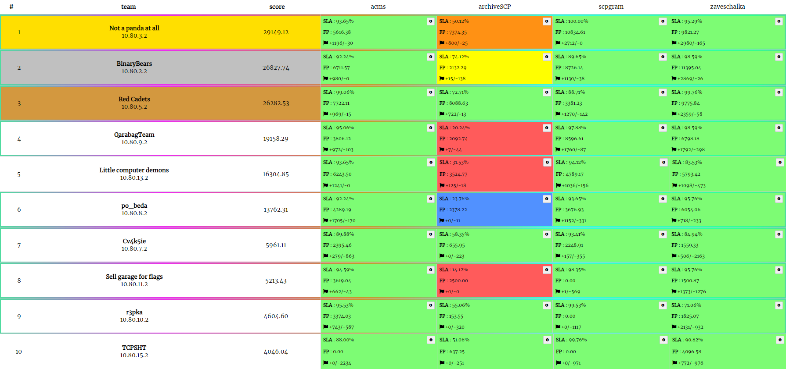

# MireaCTF Finals 2024

Ивент прошел 10 мая 2024 года. Организаторы - РТУ МИРЭА и cR4.sh

Репозиторий с чекерами, сервисами и сплойтами.

## Results

[Full scoreboard](scoreboard/full.png)

## Services

| Service                            | Language      | Checker                       | Sploits                      | Authors                                                                             |
|------------------------------------|---------------|-------------------------------|------------------------------|-------------------------------------------------------------------------------------|
| **[goservice](services/goservice/)**     | Go          | [Checker](checkers/goservice/)   | [Sploits](sploits/goservice/)   | [@ezzh](https://t.me/NikitaBazilews) |
| **[zaveschalka](services/zaveschalka/)** | PHP | [Checker](checkers/zaveschalka/) | [Sploits](sploits/zaveschalka/) | [@FrakenboK](https://t.me/helloworlddlrowolleh)                                            |
| **[scpgram](services/scpgram/)** | Python            | [Checker](checkers/scpgram/) | [Sploits](sploits/scpgram/) | [@S4ar](https://t.me/XxX_S4ar_XxX)                                    |
| **[binservice](services/binservice/)**       | C    | [Checker](checkers/binservice/)    | [Sploits](sploits/binservice/)    | [@robert_sama](https://t.me/robert_sama)                                             |

## Infrastructure

- DevOps: [@cotsom](https://t.me/cotsom)
- Checksystem: [ForcAD](https://github.com/pomo-mondreganto/ForcAD)
