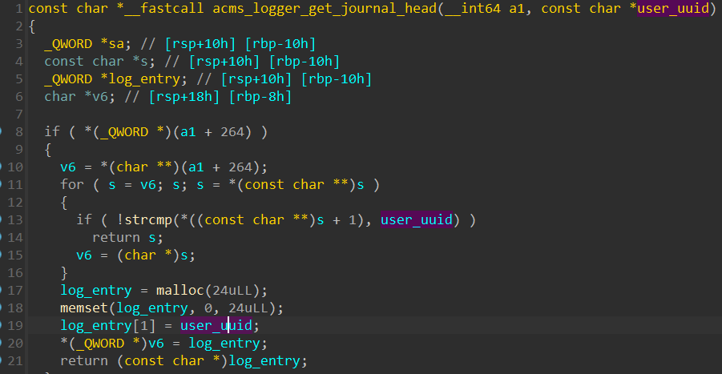

# Writeup for acms


## Description

This is a Access Control and Managment system one of the many SCP secret facilities. The user interface provides allows for creating users and control groups that can contain some devices.

Access to a device can be granted only to users with a satisfactory access level.

## Bugs

### Bug №1

The login handler contains a backdoor password that allows one to be authorized as any existing user.


This bug can be easly fixed with nopping a propriate ```jnz``` instruction.


### Bug №2

You may have noticed that the global pointer to the user UUID string is being passed to  ```acms_set_status_message_and_copy_journal```. 


As we can see, the user UUID pointer is being used in a newly allocated journal entry in a linked list as a user identifier. It's being copied and reallocated if the user logs out, but before that, the journal entry contains a global pointer to the user UUID.



Let's check "Clear logs" function.


Woops, it's just freed. Let's check it!


And if we try to call, for example, "Show profile" function


It's definately corrupted because of meta info of free heap chunk.

We can abuse it by creating user-defined logs, because it uses the heap-based getline function for getting user-inputted log messages. This means that we can obtain a pointer to the global authorized user UUID with malloc, because previously it has been placed into the free chunks list with "Clear logs".


But before allocating the UUID pointer, you should exhaust the remaining free chunks. This can be done in a controlled manner by creating log records manually.

I'm too lazy to elaborate, I hope the point is clear.

Exploitation of use-after-free looks something like this:


Bug can be “fixed” by extending malloc size. So you can't get a uuid freed chunk. 