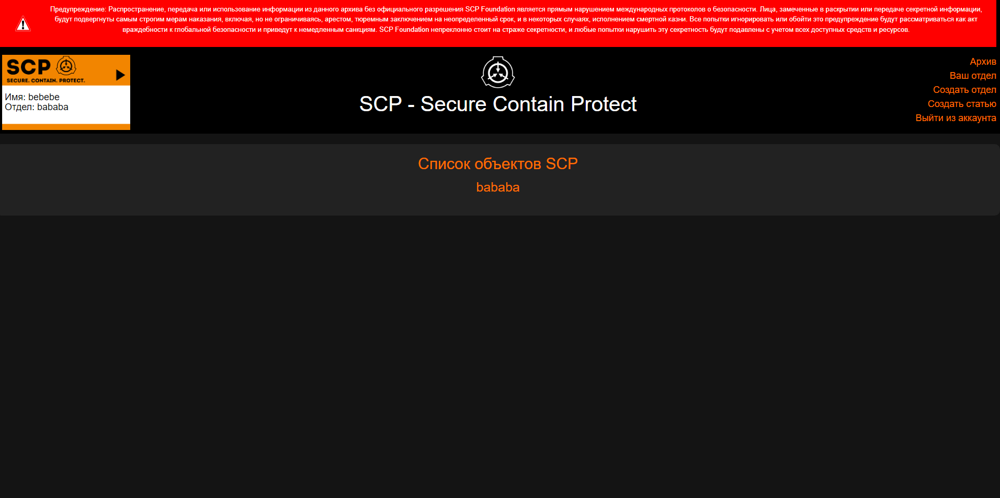

# Writeup for archiveSCP



## Description

Веб сервис который представлял из себя архив, в который можно было писать статьи. Доступ к статьям был только для того отдела, который их сделал.

## Bugs

### Bug №1

При создании объекта, в его имени был path traversal, что позваляло писать в любой файл в системы. 

```go
txtFilePath := filepath.Join("./secret-data/description", name)
txtFile, err := os.OpenFile(txtFilePath, os.O_APPEND|os.O_CREATE|os.O_WRONLY, 0644)
if err != nil {
    c.String(500, "Ошибка при открытии файла")
    return
}
defer txtFile.Close()

if _, err := txtFile.WriteString(description); err != nil {
    c.String(500, "Ошибка при записи в файл")
    return
}
```

С помощью path traversal пишем в шаблон department.html нагрузку {{ .guest.Password }}. Пишем именно в этот шаблон, потому что при рендеринге именно в него передавался объект guest, в котором был пользователь, которого мы приглашаем. 

```go
if guest.Department != "" {
		c.HTML(http.StatusOK, "department.html", gin.H{"users": database.GetDepartmentStaff(user.Department), "user": user, "error": "Пользователь уже состоит в отделе ", "guest": guest})
		return
	}
```
Это приводило к тому, что при приглашении пользователя, который состоял в другом отделе, мы узнавали не только в каком отделе он состоит, но и пароль от его аккаунта. Далее даходим за него и получаем доступ к его флагу.

Так же с помощью этой баги можно было досить чужие сервисы, просто дописывая нагрузку в файл шаблона, которую не мог съесть golang по типу "{{".

[Сплойт](./sploitSSTI.py)

### Bug №2

Кука которая выдавалась для определения департамента подписывалась не безопасно
```go
func GetDepartmentCookie(department string) string {
	hash := md5.New()
	payload := "department=" + department
	hash.Write([]byte(secretDep + payload))
	sig := hex.EncodeToString(hash.Sum(nil))
	return sig + "." + base64.StdEncoding.EncodeToString([]byte(payload))
}
```
Уязвимость заключалась в атаке на хэш length extension. Импакт заключался в том что к существующей куке можно было дописать &department=X и подписать эту куку не имея секрета, что давало доступ к отделу X. Есть много возможностей фикса, самое простое, поменять секрет и отдел при формирование подписи местами. Так же можно было вообще отказатся от этой куке, и проверять отдел юзера напрямую. 

Тулза которая может помочь при атаке length extension:
https://github.com/iagox86/hash_extender

### Bug №3 

Из-за формирования все той же куки можно было создать отдел вида X&abc=1, что давало доступ к отделу X. Все дело в неправильной проверки куки, что и приводило к багу 2 и багу 3. Тоесть при парсинге строки в куке department=bebebe&department=bababa отдел был равен bababa

```go
func MyParseQuery(rawQuery string) (map[string]string, error) {
	decodedQuery, err := url.QueryUnescape(rawQuery)
	if err != nil {
		return nil, fmt.Errorf("ошибка декодирования строки: %v", err)
	}

	values := make(map[string]string)
	params := strings.Split(decodedQuery, "&")
	for _, param := range params {
		keyValue := strings.SplitN(param, "=", 2)
		if len(keyValue) != 2 {
			return nil, fmt.Errorf("некорректный формат параметра: %s", param)
		}
		key, value := keyValue[0], keyValue[1]
		values[key] = value
	}
	return values, nil
}

parsedValues, err := MyParseQuery(string(data))
if err != nil {
    return "", fmt.Errorf("ошибка при парсинге строки запроса")
}
department, ok := parsedValues["department"]
```

Баг бы не преднамеренный, так что спасибо участникам, что нашли его. 

[Сплойт](./sploitNonintended.py)


### Powered by [ezzh](https://t.me/NikitaBazilews)
