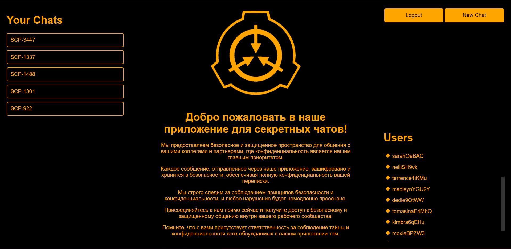

# Writeup for scpgram

## Description

It's basic python flask app with chats on socketio. Were modest features besides registration, such as create chat, add/remove member  and chats on websockets with supports markdown.    

## Bugs

### Bug №1

Brocken access control inside socket routes. We can processing `get_messages` for every chat. 

[Exploit](./logic_flaw.py)

fix option:

Add function `check_access` from db.py on sio handlers. 

### Bug №2

Vulnerable version library markdown parser `markdown2`. In [snyk](https://security.snyk.io/package/pip/markdown2) cve platform we can find few vulnerabilities for version 2.4.0. So, impact in A/D for us has ReDoS vulns. Take payload, for example `' '*100000+'$'` and send in chats -> service is down/mumble.

Fix option:

update verion markdown2

[Exploit](./dos.py)

