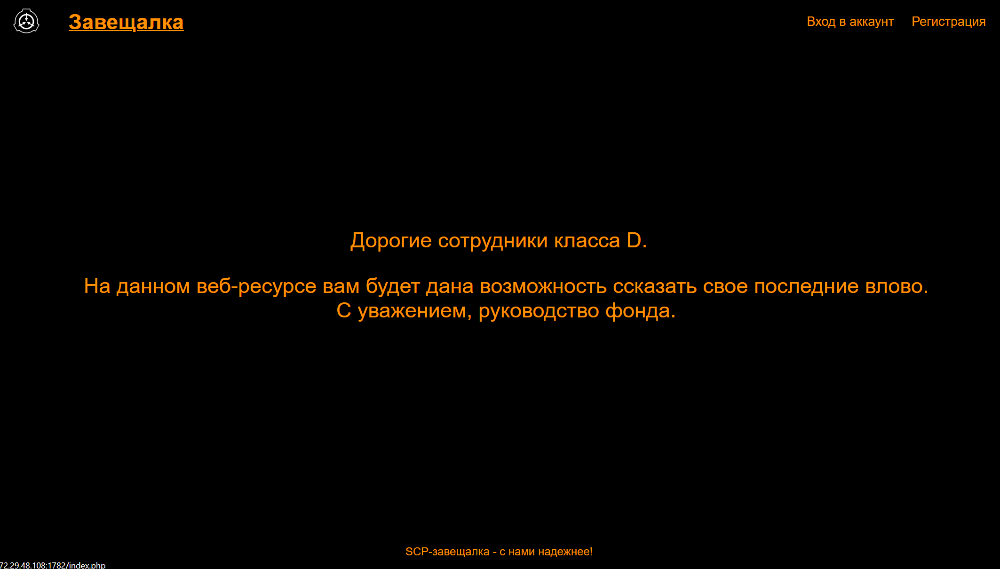

# Writeup for zaveschalka



## Description

This php application was a wills service for Class D employees. When creating a will, it was possible to share access to it. All entities, wills and users, were stored as serialized objects in the `wills` and `users` folders, respectively.

## Bugs

### Bug №1

During registration, the user object was created based on the entire `$_POST` map, but before that, only the intended parameters for registration (login, password, email, phone) were validated:

``` php
// register.php
$user = new User($_POST);

// models/user.php
class User {
    public function __construct(array $attributes) {
        foreach ($attributes as $name => $value) {
            $this->{$name} = $value;
        }
        $this->save();
    }

    public function save() {
        file_put_contents('./users/'.md5($this->login.getenv('SECRET')).'.txt', serialize($this));
    }
}
```

When requesting from the frontend to `/register.php `we don't see any other parameters being sent anywhere, however, based on the logic of creating and sharing wills, we can understand that the `User` class also uses the `wills` array, which contains the wills ids to which the user has access, but the access checks themselves wills are safe:

```php
// Creating notes and updating the wills array
$will = new Will(['title' => $_POST['title'], 'will' => $_POST['will']]);

$current_user = unserialize(file_get_contents('users/'.md5($_SESSION['user'].getenv('SECRET')).'.txt'));
if (!isset($current_user->wills)) {
    $current_user->wills = array();
}
array_push($current_user->wills, $will->will_id); 

// Checking access to wills
$user = unserialize(file_get_contents('users/'.$uid.'.txt'));

if (isset($user->wills) && in_array($_GET['id'], $user->wills)) {
    $will = unserialize(file_get_contents('wills/'.$_GET['id'].'.txt'));
    ...
}
```

Putting these two facts together, we can understand that, thanks to the special feature of the registration function, we could create a user by adding an array of wills as his attribute, in the cells of which the IDs from the attack data will be indicated:

It will look something like this:

``` php
// We send the post parameter to the /register.php handler and we specify something like this:
login=FrakenboK&password=iloveRobertSama&email=noLifeOnlyPWN@crash.mirea&phone=1337&wills[0]=<will_id>&wills[1]=<will_id>&...
// And so on
```

Fix option:

``` php
if (count($_POST) > 4) {
    echo 'IDI NAHUI';
    die();
}
```

[Exploit](./exploit_object_injection.py)

### Bug №2

The second bug was an apache missconfiguration. It allowed us to read all the files in the directory `/var/www/mireactf`. The problem was the lack of a rewrite rule on the blacklist for everything that is not included in the whitelist. This way we could read all the files, not just the ones listed by extensions. We could exploit the vulnerability by reading the files of wills with serialized objects.

Vulnerable config:

``` conf
<Directory "/var/www/mireactf">
    Options +FollowSymLinks
    AllowOverride None
    Require all granted
    RewriteEngine On
    DirectoryIndex index.php
    RewriteCond %{REQUEST_FILENAME} -f
    RewriteCond %{REQUEST_URI} !\.(php|css|png)$
</Directory>
```

Fix option:

``` conf
    RewriteRule . - [F,NC]
```

[Exploit](./exploit_apache_missconfig.py)

### Powered by [FrakenboK](https://t.me/helloworlddlrowolleh)
